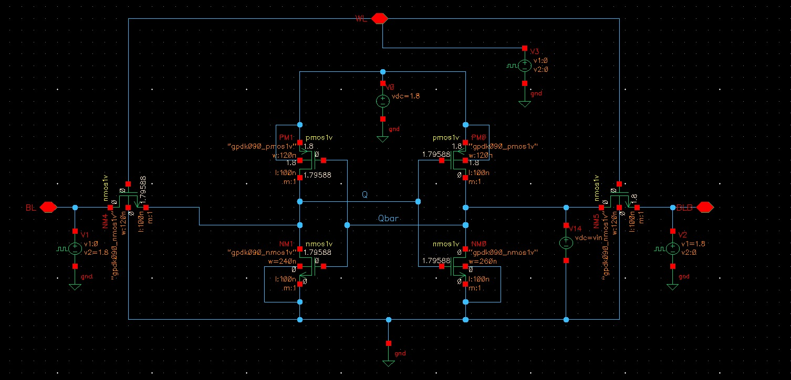
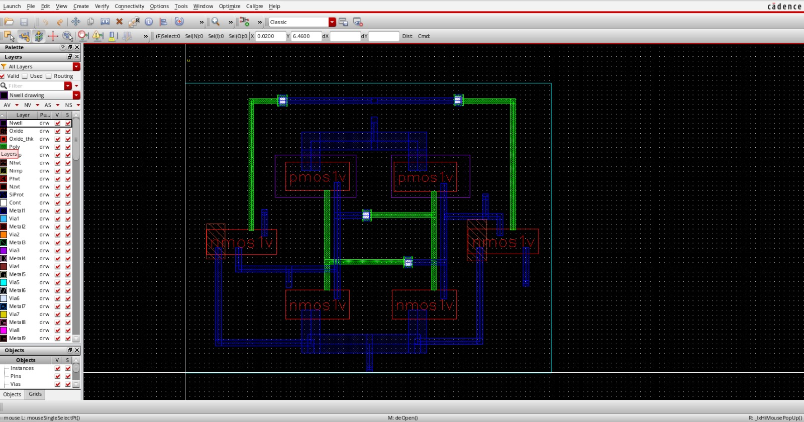
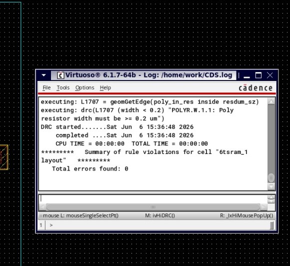
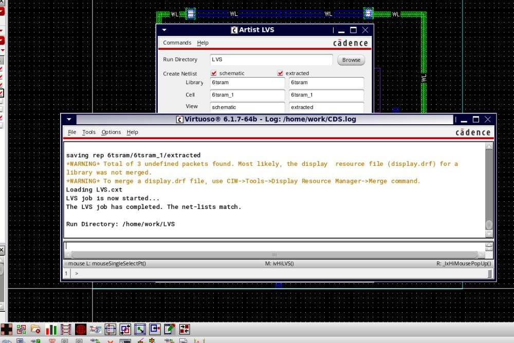
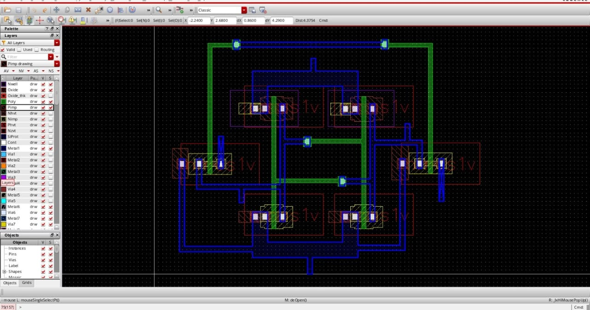
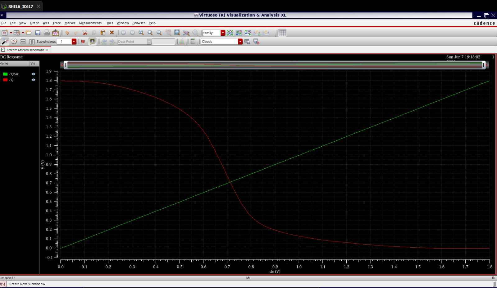

# 6T SRAM Cell Design and Layout using Cadence Virtuoso

## Overview

This project demonstrates the complete custom VLSI design flow of a 6T SRAM cell using Cadence Virtuoso and GPDK90 technology.

## Tools Used

- Cadence Virtuoso
- Spectre Simulator
- GPDK90 Technology Library

## SRAM Sizing

| Device | Width |
|----------|----------|
| Pull-Up PMOS | 120 nm |
| Access NMOS | 120 nm |
| Pull-Down NMOS | 240 nm |

## Verification Results

### DRC

✔ 0 Errors

### LVS

✔ Netlists Matched

### Extraction

✔ Successful

## Schematic

## Layout

## DRC Result

## LVS Result

## Extracted View

## DC Transfer Characteristics

## Project Flow

Schematic → Layout → DRC → Extraction → LVS → Characterization
